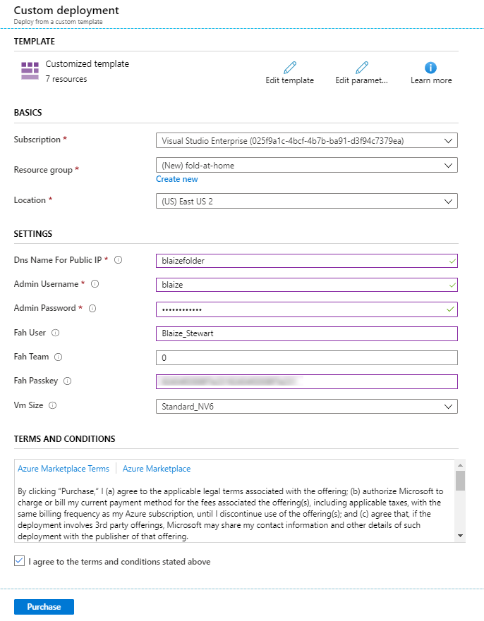
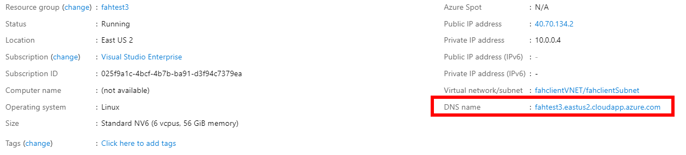
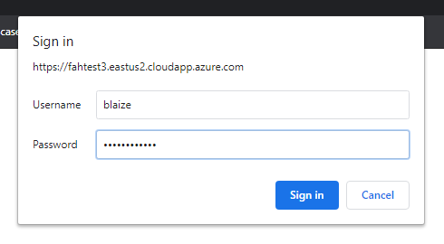
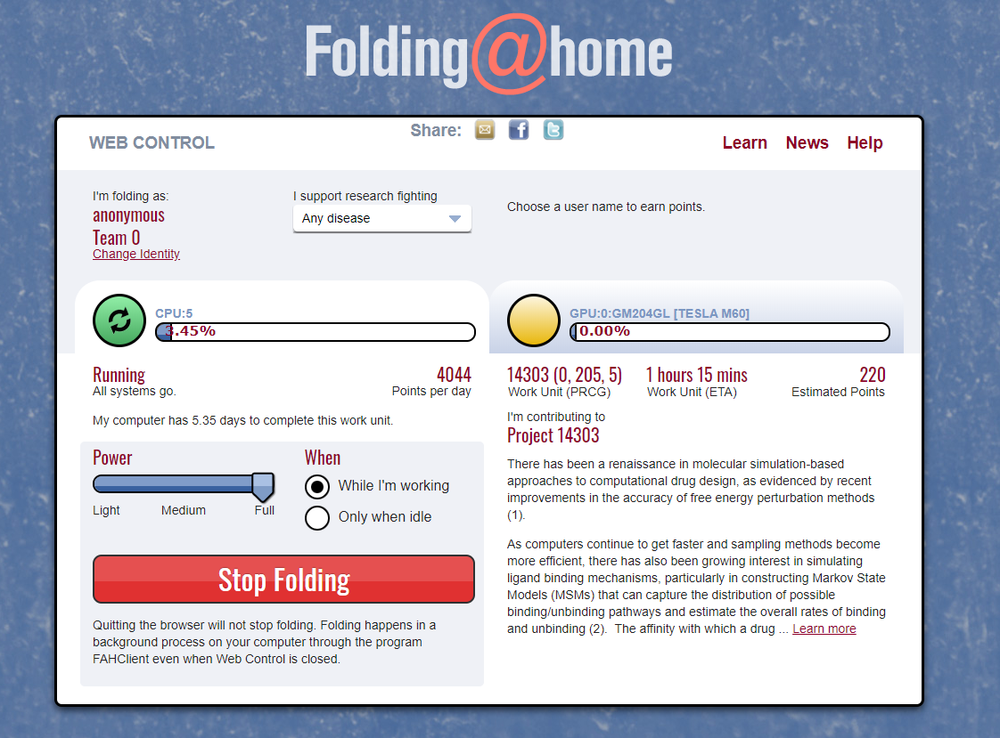
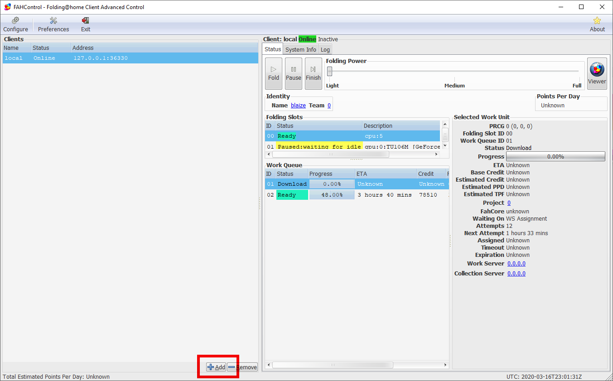
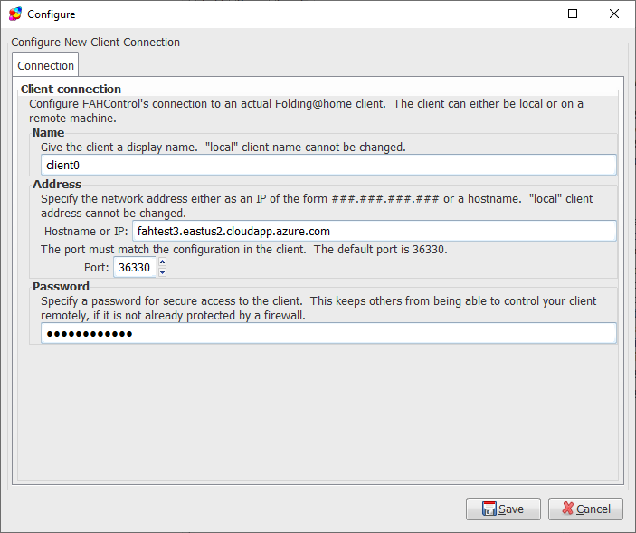

##DID YOU KNOW that you can help find a CURE for dieseases like Covid19 (aka CORONAVIRUS) using your Azure?##

When working on finding a cure, researchers first narrow the search field using computational models. These computations take massive amounts of compute resources, so some labs allow the public to contribute compute resources they have on their personal computers to the project. They use a client called "Folding@Home". This app "folds" proteins in a simulated environment to discover potential proteins that can be used to treat diseases, including Covid 19

You can download it here and install it and help find a cure for deiseases on  your computer at home. [https://foldingathome.org/](https://foldingathome.org/) Installing it is pretty easy for a home computer.

I worked on this little project today to get it running on a virtual machine on Azure. I am working out the bugs in an automation script to install it on Azure. This script installs the NVidia Drivers for the VM if you're using GPU's, installs and configures tre Fold@home software, and then proxies the Web Portal with an SSL reverse proxy and adds a logon to it so that accessing the web bortal over the intenet is secure.

###Deploy to Azure###

1. Click Deploy to Azure 

	

1. Logon to Azure if you are not already logged in. If you don't have an Azure account, [you can sign up for one for free and get $200 in Azure Credits for 30 days](https://azure.microsoft.com/en-us/free/).

1. After logging in, fill out the form for your deployment on Azure.

	

	***Under Basics...***

	* **Subscription** -- Choose your subscription you intend to use with this deployment.
	* **Resource Group** -- Choose a Resource Group to deploy the VM to run the Fold At Home client into.
	* **Location** -- Select an Azure Region to deploy the VM. If you want to use GPU-based VM's (N-series) then choose East US, East US2, North Central US, South Central US, or West US 2. For global regions, [check the availablity here](https://azure.microsoft.com/en-us/global-infrastructure/services/?products=virtual-machines).

	***Under Settings...***

	* **Dns Name For Public IP** -- This will be prepended to the front of an Azure URL. It is your unique DNS name, the region, then cloudapp.azure.com (ie. Azure blaizefah.eastus2.cloudapp.azure.com). 
	* **Admin Username** -- Used for adminstration on the VM for SSH.
	* **Admin Password** -- This password will be used for SSH access to the VM aas well as to logon to the Folding@Home client through the remote admin.
	* **Fah User** -- The Fold@Home user to display for statistical purposes. You can leave this anonymous.
	* **Fah Passkey **-- The Fold@Home Passkey is used to associate your client(s) with your work. If you do not care about recieving credit, simply leave it blank. If you want a Passkey, [sign up here](https://apps.foldingathome.org/getpasskey). You can sign up later and re-enter if you like in the web portal.
	* **VM Size** -- D-Series VM's are chgeaper, but do not have GPU's. N-Series VM's are more expensive, but have avialble GPU's See the [pricing chart here for more details](https://azure.microsoft.com/en-us/pricing/details/virtual-machines/linux/).

	***Under Terms and Conditions...***

	Check the box next to "I agree to the terms and conditions stated above." if you agree.

1. Click ****Purchase**** and wait for the VM to deploy.

1. Wait about 15 minutes for the the VM to deploy.

1. Once the virtual machine deploys, you can logon to the web client by browsing to https://dnsname.region.cloudapp.azure.com where *dnsname* is the the name of the dns entry you entered when you created the VM and *region* is the shortcode for the Azure region. If you aren't sure, then browse in the Azure Portal to Resource Groups on the left, select the resouce group you created when you deployed the VM, then click on fahclientVM. You'll find the DNS name on the Overview blade.

	

1. You will probably get a messaage about the site not being secure. **THIS IS OK!** If you click on "Advanced" in Chrome, you can bypass this error. 

1. After bypassing the error, you will be prompted for your credentials. Enter the Admin Username for th Username and the Admin Password for the Password you entered when you created the virtual machine.

	

1. If all goes well, you should see the Folding@home web portal.

	

###Advanced Controls (AKA FAHControl)###

For more advanced users, you can use the Advanced Controls that are installed with Folding@home. This utility allows you to connect to multiple clients that are running the Fold@home software. You can launch it from the tool tray menu in Windows or from the app from your Start Menu or App Folder on Mac

1. Click the +Add button.

	

1. In Hostname or IP, enter in the dnsname.region.cloudapp.azure.com where *dnsname* is the the name of the dns entry you entered when you created the VM and *region* is the shortcode for the Azure region. If you aren't sure, then browse in the Azure Portal to Resource Groups on the left, select the resouce group you created when you deployed the VM, then click on fahclientVM. You'll find the DNS name on the Overview blade.

1. Enter in the Admin Password for the Password, then click Save.

1. Once connected, your Fold@home Advanced controls is ready to go.

	

